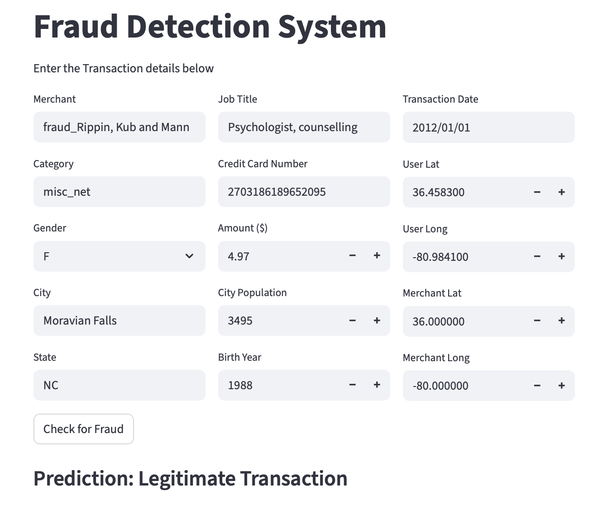
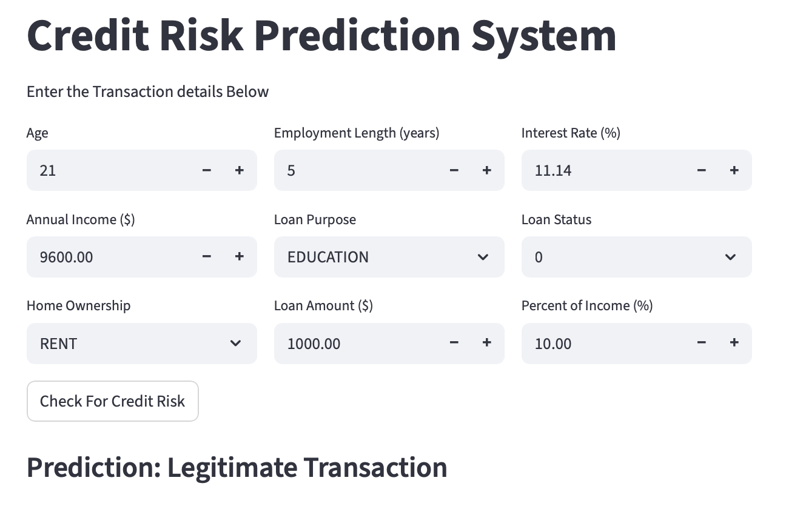

# Credit and Fraud Prediction 
> Machine learning pipelines for credit scoring and fraud detection, powered by Gradient Boosting models (LightGBM).
Includes automated data preprocessing, feature engineering, hyperparameter tuning with Optuna, model training & evaluation and an interactive Streamlit dashboard for real-time risk and fraud prediction.
99.78% accuracy on fraud detection task and 82.7% on credit risk assessment.


#### Tables of contents
* [Path tree](#path-tree)
* [Direct links to folders](#direct-links-to-folders) 
* [Installation](#installation)
* [Running the apps](#running-the-apps)
* [App previews](#app-previews)
* [ML Pipeline](#ml-pipeline)


## Path tree
```
Credit_and_Fraud_Prediction/
├── data/
│   ├── credit_risk_model/              
│   ├── datasets/    
│   ├── fraud_detection_model/    
│   └── pictures/ 
│
├── credit_risk_app.py 
├── credit_risk.ipynb
├── paiement_fraud_app.py
├── paiement_fraud.ipynb
├── README.md
└── requirements.txt
```


## Direct links to folders 
* [data](./data/) : contains all the data used for both projects
    * [datasets](./data/datasets/) : contains the datasets used for both projects
    * [credit_risk_model](./data/credit_risk_model/) : contains the saved model and related files for the credit risk project
    * [fraud_detection_model](./data/fraud_detection_model/) : contains the saved model and related files for the fraud detection project
    * [pictures](./data/pictures/) : contains images used in the README file


## Installation
1. Clone the project:
```
git clone git@github.com:tomcuel/Credit_and_Fraud_Prediction.git
cd Credit_and_Fraud_Prediction
```
2. Create a python virtual environment: 
```
python3 -m venv venv
source venv/bin/activate  # macOS / Linux
```
3. Install the requirements:
```
python3 -m pip -r requirements.txt
```
4. I used those librairies for this project: 
```py
import pandas as pd
import numpy as np 
from math import *
from datetime import datetime
import os 

import seaborn as sns
import matplotlib.pyplot as plt 
import matplotlib.dates as mdates
from colorama import Fore, Style

from sklearn.model_selection import train_test_split
from sklearn.preprocessing import LabelEncoder, RobustScaler, StandardScaler
from sklearn.feature_selection import SelectKBest, f_classif
from imblearn.over_sampling import SMOTE

import lightgbm as lgb

from functools import partial
import optuna
from optuna.integration import LightGBMPruningCallback

from sklearn.metrics import classification_report, accuracy_score, confusion_matrix, roc_auc_score, roc_curve, auc, log_loss, brier_score_loss, mean_squared_error, cohen_kappa_score, matthews_corrcoef
from sklearn.calibration import calibration_curve

import joblib 
import streamlit as st
```
5. Make sure to have Jupyter Notebook installed to run the `.ipynb` files


## Running the apps
Run the jupyter notebooks to preprocess the data and train the models. 
The trained models will be saved in the `data/credit_risk_model/` and `data/fraud_detection_model/` folders.

Then, run the Streamlit apps using the following commands :
```
streamlit run paiement_fraud_app.py
streamlit run credit_risk_app.py
```


## App previews

<table>
  <tr>
    <td style="text-align:center;">
      
    </td>
    <td style="text-align:center;">
      
    </td>
  </tr>
</table>


## ML Pipeline

#### 1. Data Loading 
* Importing datasets from CSV files
* **Fraud detection dataset**: split into 4 parts to meet GitHub size limits
* **Credit risk dataset**: loaded from a single CSV file

#### 2. Data Preprocessing 
* Exploratory Data Analysis (EDA) to extract insights and understand variable distributions
* Handling missing values using appropriate imputation strategies
* Visualizing credit behavior and fraud patterns through charts and statistical plots
* Detecting anomalies, skewed distributions, and data quality issues early in the pipeline

#### 3. Feature Engineering
* Addressing class imbalance with **SMOTE** to **upsample minority classes**
* Encoding categorical variables using **Label Encoding**
* Scaling continuous variables with **RobustScaler** to reduce sensitivity to outliers
* Removing highly correlated features to reduce multicollinearity
* Applying **SelectKBest** to keep only the most predictive features when needed

#### 4. Model training
* Hyperparameter optimization using **Optuna** (with parameter importance analysis)
* Training a **LightGBM Gradient Boosting** model using the best Optuna-selected parameters
* Using fewer boosting rounds for the large payment fraud dataset to improve efficiency
* Employing **early stopping** to prevent overfitting and stabilize model performance

#### 5. Evaluation metrics
A full suite of performance metrics is computed:
* **Accuracy**, precision, recall, specificity, sensitivity
* **Confusion matrix** and **classification report**
* **ROC curve** and **AUC score**
* LightGBM built-in visualizations (trees, **feature importances**, **learning curves**)

#### 6. Model Saving & Deployment
* Exporting the trained model using **joblib**, along with LabelEncoders and Scalers used during preprocessing
* Integrating the saved components into a real-time **Streamlit dashboard** for credit risk scoring and fraud detection
* Deploying the applications to allow interactive prediction using model-ready preprocessing
